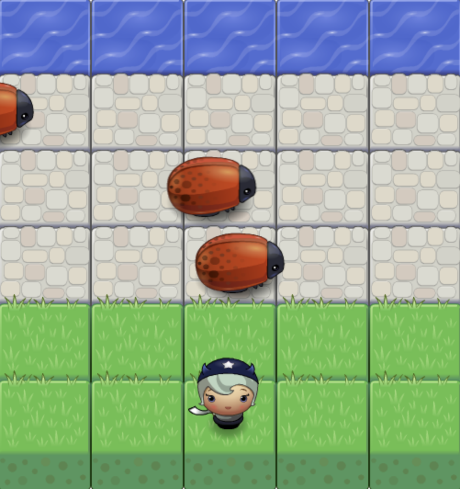

Classic Arcade Game Clone
===============================

This is a project as a part of Udacity's Front-End NanoDegree(FEND) program. Udacity provides me some starter codes, and I added essential functionalities in the **app.js** file for the game.

# Getting started
Move the character, avoid enemies, and reach the top!
### Running the file
- Download ZIP file.
- Open index.html file on your brower.
### How to play this game
- Your character is on the grass block☘️ initially.
- Using arrow keys⬆️➡️⬇️⬅️, you should go to the water block💧 at the top avoiding moving bugs🐞🐞🐞.
- If you touch any of the bugs or reach the top, your character will return to its initial location, and the game resumes.

